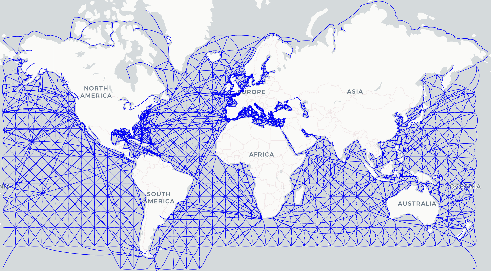

# searoute_mcp

<div align="center">

<strong>Maritime Routing MCP Server (Python)</strong>

[](https://github.com/Project-Harrison/searoute_mcp/actions/workflows/ci.yml)
[](LICENSE)


</div>

<!-- omit in toc -->
## Table of Contents

- [Overview](#overview)
- [Installation](#installation)
- [Quickstart](#quickstart)
- [Core Tools](#core-tools)
- [Example Prompts](#example-prompts)
- [Running Your Server](#running-your-server)
- [Contributing](#contributing)
- [License](#license)
- [References](#references)

---


## Overview

**searoute_mcp** is a [Model Context Protocol (MCP)](https://modelcontextprotocol.io) server for maritime routing.  
It integrates [searoute-py](https://github.com/genthalili/searoute-py) with MCP, exposing tools that allow LLM clients (e.g. Claude Desktop) to:

- Compute oceangoing route distances (in nautical miles)  
- Retrieve full oceangoing routes with waypoints (GeoJSON format)  
- Compare against geodesic great-circle distances  

All tools accept **latitude, longitude** as inputs for user friendliness, while internally converting to the required `searoute` format.

---

## Installation

Clone the repository and install dependencies:

```bash
git clone https://github.com/ShippingIntel/searoute_mcp.git
cd searoute_mcp
python3 -m venv .venv
source .venv/bin/activate   # Linux/macOS
.venv\Scripts\activate      # Windows

pip install -r requirements.txt
````

Dependencies:

* `mcp[python]>=0.1.0`
* `searoute>=1.4.3`
* `geopy>=2.4.1`

---

## Quickstart

Run the server locally:

```bash
python -m mcp_server.main
```

Install into Claude Desktop:

```bash
mcp install mcp_server/main.py
```

Test with the MCP Inspector:

```bash
mcp dev mcp_server/main.py
```

---

## Core Tools

* **`compute_distance`**
  Shortest oceangoing route distance (nm) between two coordinates.

* **`compute_route`**
  Full oceangoing route (GeoJSON geometry + distance).

* **`compute_geodesic`**
  Great-circle (sphere) distance in nautical miles, ignoring land/sea constraints.

---

## Example Prompts

All prompts use **latitude, longitude** ordering.

```json
{
  "tool": "compute_distance",
  "arguments": {
    "start_lat": 47.6062,
    "start_lon": -122.3321,
    "end_lat": 35.6895,
    "end_lon": 139.6917
  }
}
```

```json
{
  "tool": "compute_route",
  "arguments": {
    "start_lat": 40.7128,
    "start_lon": -74.0060,
    "end_lat": 48.8566,
    "end_lon": 2.3522
  }
}
```

```json
{
  "tool": "compute_geodesic",
  "arguments": {
    "start_lat": 51.5072,
    "start_lon": -0.1276,
    "end_lat": -33.8688,
    "end_lon": 151.2093
  }
}
```

Examples:

* Seattle → Tokyo (oceangoing distance)
* New York → Paris (full route with waypoints)
* London → Sydney (geodesic great-circle)

---

## Running Your Server

Choose a transport:

```bash
# stdio (local dev)
python -m mcp_server.main stdio

# Streamable HTTP (for deployment)
python -m mcp_server.main streamable-http
```

---

## Contributing

Contributions are welcome! See [CONTRIBUTING.md](CONTRIBUTING.md) for setup and workflow guidelines.

---

## License

This project is licensed under the MIT License — see the [LICENSE](LICENSE) file for details.

---

## References

**searoute_mcp** builds upon prior open-source and research projects in maritime routing and network analysis:

* [Marnet Project — Atlas of Marine Socio-economic Indicators for the Atlantic Area](http://marnetproject.eu/)
  EU transnational project led by the Northern & Western Regional Assembly, developing a socio-economic data network for the Atlantic regions.

* [searoute-py](https://github.com/genthalili/searoute-py)
  Python package for generating shortest sea routes between two points, designed for visualizing realistic maritime routes and customizable with ports and networks.

* [NetworkX](https://networkx.org/)
  Python package for the creation, manipulation, and study of complex networks. Provides the graph algorithms underpinning routing logic.

* [Eurostat SeaRoute](https://github.com/eurostat/searoute)
  Java-based library and webservice by Eurostat computing shortest maritime routes from global shipping networks enriched with AIS data, using Dijkstra’s algorithm via GeoTools.


